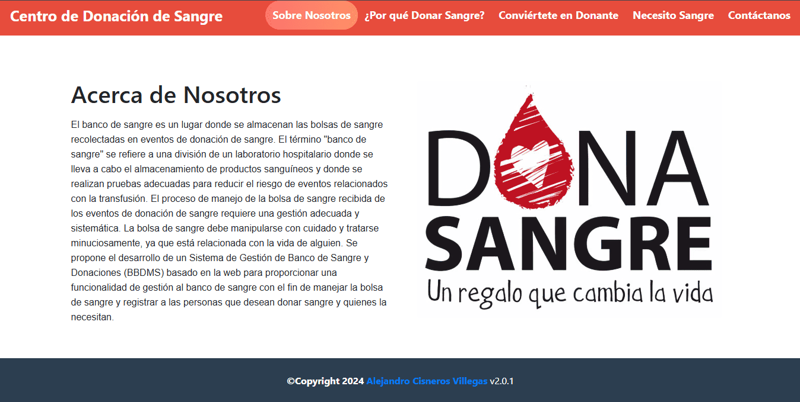
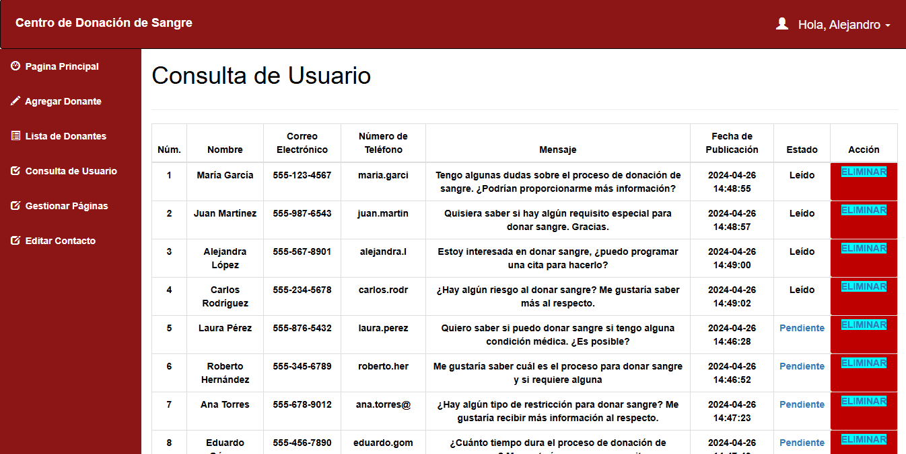
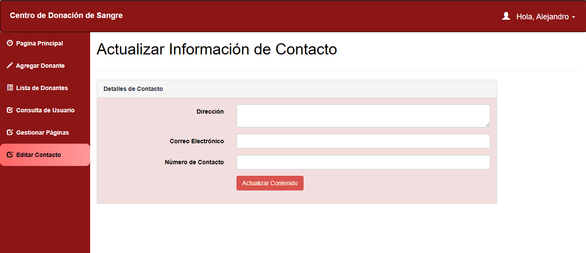

# Centro de Donación de Sangre

El **"Centro de Donación de Sangre"** es un proyecto web diseñado para promover y facilitar la donación de sangre con el fin de abastecer a hospitales y ayudar a salvar vidas. La plataforma consta de dos partes: una dirigida al público general interesado en donar sangre y otra para el personal administrativo del centro.

<p align="center">
  
</p>

Para el público, el sitio ofrece información detallada sobre la importancia de la donación de sangre, requisitos para donar, beneficios de la donación y la posibilidad de registrarse como donante. Además, proporciona un formulario para solicitar sangre y un medio de contacto para consultas.

<p align="center">
  
</p>

Para el personal administrativo, la plataforma ofrece un panel de control para gestionar la información de donantes, atender consultas de usuarios, modificar contenido en la página pública y gestionar consultas pendientes. El sistema asegura una gestión eficiente y segura de la donación de sangre.

<p align="center">
  
</p>

En resumen, el **"Centro de Donación de Sangre"** es una herramienta integral que facilita la donación de sangre, brinda información relevante y garantiza una gestión administrativa eficaz para ayudar a quienes más lo necesitan.

<p align="center">
  
</p>

**Consulta la versión preliminar del proyecto aquí (Usuario):** [https://centro-de-donacion-de-sangre-usuario.com](https://www.alejandrovillegas.net/projects/project-05/home.php)

**Consulta la versión preliminar del proyecto aquí (Administrador):** [https://centro-de-donacion-de-sangre-administrador.com](https://www.alejandrovillegas.net/projects/project-05/admin/login.php)

# 📌 Información del Proyecto

Este proyecto ha sido desarrollado como parte del portafolio de soluciones tecnológicas, con el objetivo de ofrecer una herramienta eficiente y funcional para usuarios autodidactas interesados en la gestión y desarrollo de proyectos web.

- **Área**: Desarrollo de Proyectos Web

- **Usuario Final**: Autodidactas y Desarrolladores

- **Fecha de Desarrollo**: 20 de abril de 2024

- **Portafolio de Proyectos**: [www.alejandrovillegas.net](https://www.alejandrovillegas.net/)

# Guía de Instalación y Configuración del Proyecto

## 🖥️ Requisitos del Sistema

Para ejecutar este proyecto de manera local, es necesario contar con un entorno de desarrollo que incluya Apache, MySQL y PHP. Se recomienda el uso de **XAMPP**, ya que fue el entorno con el que se desarrolló el proyecto. Sin embargo, también es compatible con:

- **XAMPP** (Windows, macOS, Linux)

- **WAMP** (Windows)

- **MAMP** (macOS, Windows)

- **LAMP** (Linux)

## 🔧 Instalación y Configuración del Proyecto

Siga los pasos según el entorno de desarrollo que esté utilizando:

### Para XAMPP (Recomendado)

1. Descargue y descomprima el archivo del proyecto en su sistema local.

2. Copie la carpeta del proyecto y colóquela en el directorio **_htdocs_** dentro de la carpeta de instalación de XAMPP (Ejemplo: **C:\xampp\htdocs\mi_proyecto**).

### Para WAMP

1. Descargue y descomprima el archivo del proyecto.

2. Copie la carpeta del proyecto y colóquela en el directorio **_www_** dentro de la carpeta de instalación de WAMP (Ejemplo: **C:\wamp64\www\mi_proyecto**).

### Para MAMP

1. Descargue y descomprima el archivo del proyecto.

2. Copie la carpeta del proyecto y colóquela en el directorio **_htdocs_** dentro de la carpeta de instalación de MAMP (Ejemplo: **/Applications/MAMP/htdocs/mi_proyecto**).

### Para LAMP

1. Descargue y descomprima el archivo del proyecto.

2. Mueva la carpeta del proyecto a **_/var/www/html/_** utilizando el siguiente comando en la terminal:

```
sudo mv mi_proyecto /var/www/html/
```

## 🗄️ Configuración de la Base de Datos

### Para XAMPP, WAMP y MAMP

1. Inicie su entorno de desarrollo y asegúrese de que **Apache** y **MySQL** estén en ejecución.

2. Abra su navegador y acceda a **_phpMyAdmin_** ingresando:

- **XAMPP**: http://localhost/phpmyadmin

- **WAMP**: http://localhost/phpmyadmin

- **MAMP**: http://localhost:8888/phpmyadmin

3. Diríjase a la pestaña **SQL** e ingrese el siguiente código para crear la base de datos:

```
CREATE DATABASE General;
```

4. Vaya a la pestaña Importar y seleccione el archivo **_DataBase.sql_** del repositorio para importar la estructura y los datos.

### Para LAMP

1. Abra la terminal y acceda a MySQL con:

```
mysql -u root -p
```

2. Cree la base de datos ejecutando:

```
CREATE DATABASE General;
```

3. Salga de MySQL y luego importe la base de datos con:

```
mysql -u root -p General < /ruta/del/archivo/DataBase.sql
```

Reemplace **_/ruta/del/archivo/_** con la ubicación real del archivo en su sistema.

## 🚀 Ejecución del Proyecto

1. Inicie su entorno de desarrollo:

- **XAMPP**: Abra el "Panel de Control de XAMPP" y active **Apache** y **MySQL**.

- **WAMP**: Haga clic en el icono de WAMP y active los servicios.

- **MAMP**: Abra MAMP y haga clic en **Start Servers**.

- **LAMP**: Ejecute los siguientes comandos en la terminal:

```
sudo systemctl start apache2
sudo systemctl start mysql
```

2. Abra un navegador e ingrese la siguiente URL según el entorno:

- **XAMPP / WAMP**: **_http://localhost/_**

- **MAMP**: **_http://localhost:8888/_**

- **LAMP**: **_http://localhost/_**

El proyecto ahora está funcionando en su entorno local. 🎉

## 🔑 Credenciales de Acceso

### 🛠️ Detalles de Inicio de Sesión para Administrador

- Nombre de usuario: **_Alejandro_**

- Contraseña: **_12345_**

Tambien puede **registrar un nuevo usuario** desde la interfaz de la aplicación.
